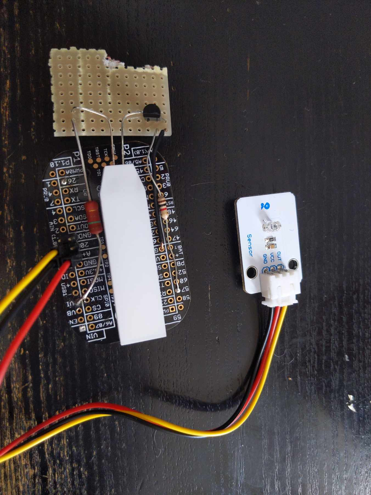

# Glass To Glass
## A device to measure visual latency of a video camera+screen

### Parts
1) Beaglebone pocket (https://uk.farnell.com/beagleboard/bb-pocket/pocket-beagle-board-arm-cortex/dp/2806159 )
2) Light sensor ( https://www.velleman.eu/products/view/?id=435572 )
3) Large LED (https://shop.pimoroni.com/products/white-led-backlight-module?variant=36999548170 )
4) Transistor BC547
5) Resistors 1k Ohm + 150 Ohm
6) SD card for BB OS

```
                                                                        
                         .-------------------.                          
                         |                   |                          
                         |                 VIo-----------o              
                         |                   |           |              
                         |               P2_6o-----o    .-.             
                         |                   |     |    | |  150 ohm    
                         |                   |    .-.   | |             
      .------.           |                   |  1k|ohm  '-'             
      |LCR   |           |                   |    | |    |              
      |      o-----------oA+                 |    '-'    |              
      |      |           |   Pocket Beagle   |     |   |/               
      |      o-----------oA-                 |     o-o-|      BC547     
      |      |           |                   |         |>               
      |      o-----------oA0                 |           |              
      |      |           |                   |           |              
      '------'           |                   |           V ->     LED   
                         |                   |           -              
                         |                   |           |              
                         |                GNDo-----------o              
                         |                   |                          
                         |                   |                          
                         |                   |                          
                         |                   |                          
                         |                   |                          
                         '-------------------'                          
                                                                        
                                                                        
                                                                        
                                                                        
                                                                        
                                                                        
(created by AACircuit.py © 2020 JvO)

```
### Dependencies
```
sudo apt-get update
sudo apt-get install build-essential python3-dev python3-pip -y
sudo pip3 install Adafruit_BBIO
```

### Theory
Based on a [blogpost by Vay](https://medium.com/vay-technology/how-to-measure-glass-to-glass-video-latency-13256037e552)

The idea is that we point the camera under test at the LED which flashes, the Photosensor (LCR) is placed on the display screen over the image of the LED.
When the LED flashes it will cause fluctuations in the voltage on the analog input A0. By rapidly polling the value on A0 we can detect when the image of the LED dims.
The time difference between the LED being switched off and it being detected is the glass-to-glass latency.

### Accuracy 
The Beaglebone read the analog input in < 1ms in python. This is fast enough.

The accuracy is 12bits which is sufficient to detect the LED brightness changes.

### Usage

Arrange the camera so it can see the LED.

Hold the Sensor so that it is over the image of the LED on the viewing screen.

Run 
```
python measure-cli.py
```
The LED will flash 51 times. (Taking > 1min)

The G2G latency will be displayed.

### How it works 

The code tries to calibrate the brightness with a single long flash and calculates the max, min and mean
values of the input voltage in that period, leaving the LED on.

If the max-min is > 25% then it switches the LED off and polls the input until it drops below the mean value calculated in the first step.
it records the time difference, turns the LED back on and waits 1 second. It repeats this 50 times.

The reported value is the average of these 50 values.

### Practicalities
If possible you should disable auto white balance and auto exposure in the camera, since these both reduce the sensitivity of the measurement.

Likewise turn the screen brightness up to max and disable auto brightness.
(or ensure that the LED is a sufficiently small proportion of the screen area so that the sceen does not dim when the LED is on.)

For best results secure the light sensor _very_ close to the screen and ensure that it is on the area illuminated by the LED.

You may need to adjust the room lighting and screen brightness to get above the 25% threshold.

We did not add a TFT display since this would probably be in view and change the readings, so the values arrive on the commandline.

If the light sensor is not available you could try this https://uk.farnell.com/dfrobot/sen0043/analog-ambient-light-sensor-arduino/dp/3517892

### Prototype


### Some numbers

2 person calls, from an m1 mac mini with a picam to an ipad

Zoom 267ms
Galene 294ms
rendezvous.family 255ms
